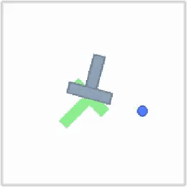
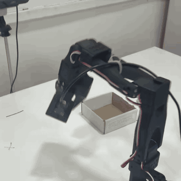

# Patch Policy

visuomotor policies simply need dense features.
replacing global-pooled features with these patch features


Reproduction of [Patch Policy: Efficient Embodied Control via Dense Visual
Representations](https://patch-policy.github.io/) (arXiv 2607.18236) on Push-T,
DINOv2 + Diffusion Policy head. **Paper target: 0.83 coverage** (Table 13),
100 rollouts — **this repro gets 0.772** ([Results](#results)).

<table>
<tr>
<td></td>
<td></td>
</tr>
<tr>
<td align="center">Push-T, one <code>patchpol.eval</code> rollout</td>
<td align="center">SO-101, 2× speed (<a href="#real-robot-so-101">below</a>)</td>
</tr>
</table>

## How it works

```
224x224 frame ──frozen DINOv2 ViT-S/14──▶ 256 patch tokens × 384d   (features.py)
2 frames of tokens ──block-causal transformer──▶ per-frame readout   (model.py)
readout ──DDPM denoiser (100 steps)──▶ 5-action chunk in [-1,1]      (diffusion.py)
```

The block-causal mask is the paper's core: bidirectional attention *within* a
frame's 256 tokens, causal *across* frames. `model.py` unit-tests this by
perturbation (no time travel / memory flows forward / intra-frame bidirectional).

## Setup (fresh machine)

```bash
uv sync
uv run python -m patchpol.prepare   # download 206 demos -> re-render @224 -> DINOv2 features (~5GB)
```

Or read the same 206 demos from the hub as a LeRobot v3 dataset — 96px video
bicubic-upscaled to 224, since `observation.state` carries no block pose and
re-rendering is impossible:

```bash
uv run python -m patchpol.lerobot_data       # download + self-check the reader
uv run python -m patchpol.lerobot_features   # DINOv2 features -> ~5GB zarr
```

Train-time and eval-time featurization must match, so `--data lerobot` pairs
with `--pixels96` at eval; mixing them costs coverage silently. Never
`uv add lerobot` — every release pins `numpy<2.3` and `torchvision<0.26` and
would downgrade the whole torch stack, so `lerobot_data.py` reads the v3 format
itself on huggingface-hub + pyarrow.

## Train

```bash
uv run python -m patchpol.train --batch-size 256 --amp                 # 50k steps, lr 1e-4 (Table 11)
uv run python -m patchpol.train --batch-size 256 --amp --data lerobot  # same, on the hub dataset
```

Checkpoints land in `checkpoints/` every 5k steps. Loss falls from ~1.0 to
~0.003. On a 4090 the full 50k steps take **~3.5 h** at ~3.9 it/s.

**`--amp` is not optional on a 24 GB card.** The block-causal `attn_mask` forces
`F.scaled_dot_product_attention` off the flash kernel onto the math path, which
materializes the full `(B, heads, 512, 512)` score matrix. Plain fp32 at bs 256
needs ~24.1 GB and OOMs on a 4090; bf16 autocast peaks at **15.8 GB** and is
~2.3x faster, with the same loss curve. Also set:

```bash
export PYTORCH_CUDA_ALLOC_CONF=expandable_segments:True
```

If you'd rather not use autocast, keep the paper's effective batch by
accumulating instead (~8 h): `--batch-size 128 --grad-accum 2`.

## Eval

```bash
uv run python -m patchpol.eval --ckpt checkpoints/final.pt                  # 100 rollouts
uv run python -m patchpol.eval --ckpt checkpoints/final.pt --episodes 5 --video 2
uv run python -m patchpol.eval --ckpt checkpoints/final.pt --pixels96       # --data lerobot checkpoints
```

Reports final coverage (paper's metric), max coverage, and success rate
(coverage > 0.95). Eval uses the **EMA** weights. Action bounds ride in every
checkpoint as `act_min`/`act_max`, so checkpoints stay self-describing across
both data paths.

## Results

100 rollouts on `final.pt` (50k steps, EMA), RTX 4090:

| metric | this repro | paper (Table 13) |
|---|---|---|
| **final coverage** | **0.772 ± 0.032** | **0.83** |
| max coverage | 0.821 ± 0.028 | — |
| success rate (>0.95) | 52% | — |

About 0.06 short of the paper. The informative number is the gap between *max*
(0.821, essentially at target) and *final* (0.772): the policy reliably drives
the T onto the goal but sometimes drifts back off before the 300-step limit, so
it loses coverage it had already earned. That's terminal-holding, not a failure
to learn the task — closing it is where the remaining 0.06 lives (longer
training, receding-horizon replanning, or the paper's per-frame chunk readout).

Coverage varies run to run: only the env seed is fixed (`env.reset(seed=ep)`),
while the DDPM sampler draws fresh noise each rollout.

Progress for reference — the same checkpoint family early in training:

| checkpoint | final coverage | success rate |
|---|---|---|
| `step_5000.pt` (10 eps) | 0.596 | 40% |
| `final.pt` (100 eps) | 0.772 | 52% |

## Real robot (SO-101)

The second GIF is the same trunk and DDPM head on an SO-101 arm: two camera
views (`views=2`), 6-D joint actions, 16 teleoperated episodes recorded as a
LeRobot v3 dataset, running on a MacBook M3 Pro at ~400 ms per action chunk.
The two-view training script isn't in this repo — it lives on the training box,
and the export runs under `lerobot-rollout` as a policy plugin.

One lesson worth stealing: 38% of the recorded frames were idle, and at action
horizon 5 *none* of those frames have motion in their label, so the policy
learns to hold still and never leaves home pose. Trim the idle prefixes and
lengthen the action horizon.

## Files

| file | what |
|---|---|
| `patchpol/dataset.py` | zarr -> (2-frame obs, 5-action chunk) windows, episode-boundary padding via index clipping |
| `patchpol/render224.py` | re-render all 25,650 frames at 224px from ground-truth sim state |
| `patchpol/features.py` | frozen DINOv2 ViT-S/14 -> (25650, 256, 384) fp16 patch features |
| `patchpol/model.py` | block-causal trunk (8L/6H/384d, 14.4M params) + causality unit tests |
| `patchpol/diffusion.py` | hand-rolled DDPM (squared-cosine schedule), transformer denoiser (8L/4H/256d), EMA |
| `patchpol/train.py` | AdamW, cosine LR + warmup, EMA tracking, `--amp` (bf16) + `--grad-accum` |
| `patchpol/eval.py` | gym-pusht rollouts, online DINOv2, coverage metrics, videos |
| `patchpol/prepare.py` | one-shot data prep for a fresh machine |
| `patchpol/lerobot_data.py` | minimal LeRobotDataset v3 reader (no `lerobot` package) + dataset class |
| `patchpol/lerobot_features.py` | 96 -> 224 upscale + DINOv2 precompute for the LeRobot path |

## Known deviations from the paper

- Paper doesn't specify the trunk size for the DP variant (Table 11's
  8L/4H/256 reads as the denoiser); we use 8L/6H/384 (no projection, so trunk
  width = DINOv2's 384).
- Diffusion specifics (schedule, 100 steps, EMA) follow the original Diffusion
  Policy since the paper doesn't state them.
- Conditioning uses the last frame's readout only; the paper reads out a chunk
  at every frame. This is the most likely source of the terminal-drift gap in
  [Results](#results).
- Training runs in bf16 autocast (`--amp`); the paper doesn't state a precision.
- `pymunk` must stay `<7` (gym-pusht uses the pymunk 6 collision API).
